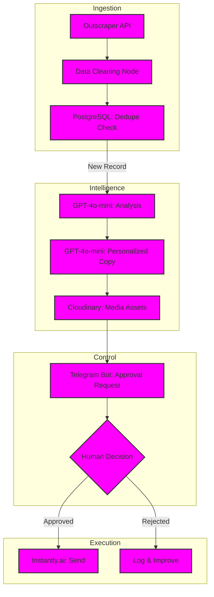

# Architecture — Review Outreach Pipeline

## Detailed System Flow

## Components

- **Outscraper Intake:** Automatically fetches fresh business and review data based on agency-defined criteria.
- **PostgreSQL Dedupe:** A robust database layer that tracks outreach history to prevent redundant communication.
- **GPT-4o-mini Scoring:** Evaluates the sentiment of existing reviews to determine the best outreach strategy.
- **Telegram Approval Gate:** The system sends a formatted message to the agency's Telegram, allowing them to approve or edit the AI's draft in real-time.
- **Cloudinary Media:** Manages and optimizes any personalized images or dynamic assets used in the outreach.
- **Instantly Delivery:** Handles the actual sending of emails, ensuring high deliverability and warm-up management.

## Data Flow
1. **Scraping:** Leads are pulled from public sources via Outscraper.
2. **Filtering:** Records are checked against the central PostgreSQL database to avoid duplicates.
3. **Generation:** AI creates a personalized message based on the customer's specific profile.
4. **Review:** An agency staff member receives a Telegram notification to approve the draft.
5. **Sending:** Once approved, the message is queued and sent through Instantly.

## Resilience & Compliance
- **Isolation by Design:** Each client has their own isolated workflow environment to prevent data leakage.
- **Human-in-the-Loop:** The Telegram gate ensures that no AI hallucinations ever reach a customer.
- **Deduplication:** A "no-double-outreach" guarantee is enforced at the database level.

## Confidentiality
Specific business logic for scoring, agency-level prompts, and outreach history are withheld for confidentiality.
