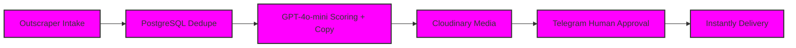
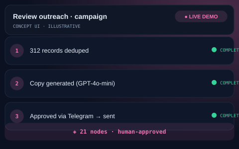

# ⭐ White-Label Review Outreach Pipeline

## The Problem
Marketing agencies often struggle to scale review outreach services without descending into spam. The lack of personalization and the risk of double-messaging customers leads to poor conversion and brand damage. Agencies needed a white-label, scalable solution that combined AI efficiency with human quality control.

## The Solution
We engineered a 21-node automation pipeline that handles the entire outreach lifecycle—from lead intake to personalized delivery. By incorporating a Telegram-based human approval gate, the system ensures that every message is perfect before it hits a customer's inbox, all while maintaining strict client isolation.

- **21-Node Pipeline:** A comprehensive workflow managing data cleaning, scoring, and delivery.
- **Automated Intake:** Direct integration with Outscraper for high-quality lead generation.
- **Smart Deduplication:** PostgreSQL-driven logic to ensure no customer is ever messaged twice.
- **AI Personalization:** GPT-4o-mini drafts tailored outreach copy based on specific interaction scores.
- **Human Approval Gate:** A Telegram interface allowing for one-click approval or rejection of AI-drafted copy.
- **White-Label Ready:** Isolated per-client deployments, making it a "productized" service for agencies.

## Architecture at a Glance

## Key Metrics
| Metric | Value |
| :--- | :--- |
| Pipeline Nodes | 21 Distinct Steps |
| Outreach Accuracy | 100% Deduplicated |
| Delivery Platform | Instantly.ai |

## What Was Built
- [x] Full 21-node outreach automation pipeline.
- [x] Intelligent record deduplication engine.
- [x] AI-driven scoring and personalized copy generator.
- [x] Cloudinary media management integration.
- [x] Telegram-based human-in-the-loop approval system.
- [x] Per-client isolated deployment architecture.

## Deliberately Not Published
- [ ] 🔒 Agency credentials and business logic.
- [ ] 🔒 Production datasets and client outreach lists.
- [ ] 🔒 Specific tenant configurations and Instantly.ai settings.

This repository is a portfolio presentation. No proprietary workflows, source code, or client data are published — by design.

## See It in Action

> Illustrative concept UI — a visual walkthrough of the workflow. Not a production screenshot.

## Tech Stack
- n8n
- Outscraper
- PostgreSQL
- GPT-4o-mini
- Cloudinary
- Telegram
- Instantly

---
[Architecture Deep-Dive](ARCHITECTURE.md) · [Case Study](CASE-STUDY.md)

**Built by MB Sabbir — AI Automation Engineer**  
*Production-grade automation, not templates*
