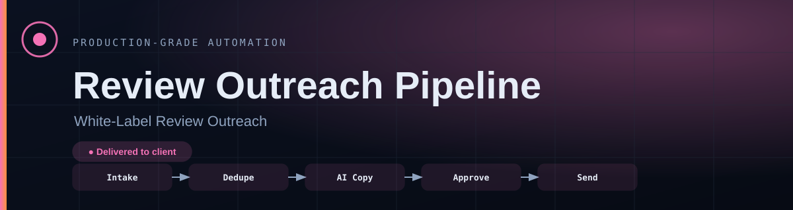
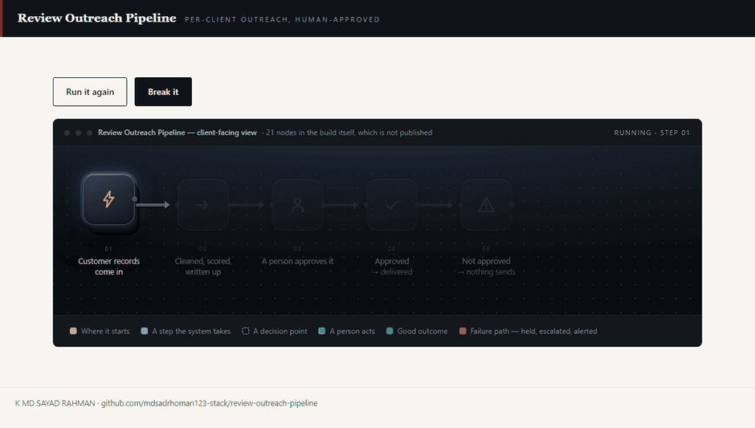
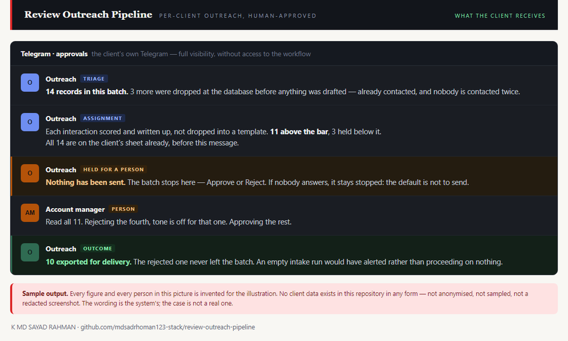
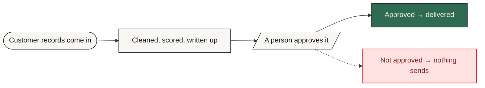

# Review Outreach Pipeline

**Customer records are cleaned, scored and turned into outreach copy — then a human approves in Telegram before anything sends.**

     [](https://github.com/mdsadrhoman123-stack/review-outreach-pipeline/actions/workflows/honesty-check.yml)



<p align="center">21 nodes · <b>5 failure paths, every one alerted</b> · 1 human approval gate · tenant-isolated infrastructure</p>

**One execution, with a failure injected into it on purpose — and the work still finishing.** That is a recording of [`docs/index.html`](docs/index.html) in this repository — one file, no build step, no network — running its own steps, not an illustration of them. The red step is the interesting one: it is held, someone is told, and then it is dealt with and the run carries on. Nothing fails quietly. Open the page yourself and **Break it** lights every failure path at once, each carrying what happens next.

> [!NOTE]
> **What this is.** A production-grade system built to a brief that businesses in this sector post publicly, in their own words — the problem exactly as they stated it, not one invented to demonstrate something. It was engineered the way anything a business actually depends on has to be: the failure paths designed before the features, every one of them logged and alerted rather than left to chance. It runs on my own infrastructure. It is ready to deploy for any business with this problem, and it has not been sold or deployed into a customer's business yet.

| | |
| :--- | :--- |
| **Built for** | Agencies delivering white-label to their own clients |
| **The brief** | The problem exactly as businesses in this sector post it — public job briefs on Upwork and Fiverr, in their words, not my framing |
| **Industry** | E-commerce & local business |
| **Status** | running on my own n8n |
| **Failure paths designed** | 5 — each with how it is detected, what the system does about it, and who finds out |
| **My role** | Sole engineer — scoping, architecture, build, failure design and operation |
| **Availability** | Ready to deploy for any business with this problem — built once as a product, not as a one-off. Running on my own infrastructure; not sold yet. |

---

### On this page

[The problem](#the-problem) · [What changed](#what-changed) · [What the client gets](#what-lands-in-front-of-the-client) · [How it works](#how-it-works) · [The shape of it](#the-shape-of-the-system) · [When it breaks](#when-it-breaks) · [Why this way](#why-it-is-built-this-way) · [Limitations](#honest-limitations) · [What is here](#what-is-in-this-repository) · [Read deeper](#read-deeper)

---

## The problem

Agencies wanted a scalable way to turn customer interactions into public reviews without a generic tool that mixes every client's data together.

The two failure modes are equally bad: a shared system that leaks one client's records into another's, and copy that reads as obviously automated and gets ignored.

So the requirement was per-client isolation and a human approval step — not more volume.

## What changed

| | Before | After |
| :--- | :--- | :--- |
| **Client data** | One shared pool | Isolated infrastructure per client |
| **Duplicate contact** | Possible and embarrassing | Blocked at the database |
| **Copy review** | Nobody reads it | A person approves in Telegram first |
| **Client visibility** | Ask the agency | A live sheet they can open |
| **Default on failure** | Send anyway | Hold |

<sub>Before/after describes the change in process, not benchmarked throughput. Where a number is not measured, it is not claimed.</sub>

## What lands in front of the client



**Sample output — every figure and every person in it is invented for the illustration.** No client data exists in this repository in any form: not anonymised, not sampled, not a redacted screenshot. What is not invented is the shape of it — the steps are this project's own, and the step called out mid-way is one row of the failure table further down this page, with what happened instead. It is a rendered image rather than markup for the same reason the internal build is not published: the output is a template, and a template in markup is a template anyone can paste into their own project and run.

## How it works

Records are pulled in, deduplicated in PostgreSQL, scored and written up by an AI step, logged to a sheet for visibility, then held at a Telegram approval gate before export for delivery.

<table>
<tr>
<td width="42" valign="top" align="center"><b>01</b></td><td valign="top"><b>Records come in</b><br>Intake is pulled on a schedule for one client's own instance.</td>
</tr>
<tr>
<td width="42" valign="top" align="center"><b>02</b></td><td valign="top"><b>Duplicates are killed</b><br>Deduplication happens in the database before anything is drafted, so nobody is contacted twice.</td>
</tr>
<tr>
<td width="42" valign="top" align="center"><b>03</b></td><td valign="top"><b>Copy is drafted</b><br>Each interaction is scored and written up rather than dropped into a template.</td>
</tr>
<tr>
<td width="42" valign="top" align="center"><b>04</b></td><td valign="top"><b>The client can see it</b><br>Everything is logged to a sheet, so the client has visibility without access to the workflow.</td>
</tr>
<tr>
<td width="42" valign="top" align="center"><b>05</b></td><td valign="top"><b>A person says yes</b><br>The batch stops at a Telegram approval. If nobody answers, nothing sends.</td>
</tr>
<tr>
<td width="42" valign="top" align="center"><b>06</b></td><td valign="top"><b>Then it delivers</b><br>Only approved records are exported for delivery.</td>
</tr>
</table>

### How it flows

<sub>What happens to the client's work, in the order they experience it. The internal build — node graph, execution order, prompts, thresholds — is deliberately not published.</sub>



<details>
<summary><b>What the shapes mean</b> — colour is not the only signal</summary>

| Shape | Means |
| :--- | :--- |
| **rounded** | Where the client's process starts |
| **box** | Something the system does |
| **diamond** | A decision point |
| **slanted** | A person has to act |
| **green box** | The good outcome |
| **red box** | Failure path — held, escalated or alerted |

Red appears in exactly one role across every repo in this portfolio: where failure goes. Nowhere else. If you see red, something is being held, escalated or alerted.
</details>

> **Walk it interactively** — [`docs/index.html`](docs/index.html) is a single self-contained page. Download it, open it in any browser, and it executes one run in front of you — failure included. **Run it again** gives you a clean pass, **Break it** lights every failure path at once. Nothing to install, no network calls.

## The shape of the system

Parts and the role each one plays. Not the wiring — no execution order, no prompt text, no thresholds. That is a deliberate line, and the last branch of the tree names exactly what sits on the other side of it.

```text
Review Outreach Pipeline — the running system
│
├── Interfaces ...................... the systems it talks to
│   ├── Outscraper .................. Record intake
│   ├── Cloudinary .................. Hosts the review images
│   ├── Google Sheets ............... Visibility for the client without giving them the workflow
│   └── Instantly ................... Receives the approved export for delivery
│
├── Judgement ....................... where a decision or a piece of writing is made
│   └── GPT-4o-mini ................. Scores the interaction and drafts the outreach copy
│
├── Memory .......................... what is remembered, and for how long
│   └── PostgreSQL .................. Deduplication, so nobody is contacted twice
│
├── Oversight ....................... how a human stays in the loop
│   └── Telegram .................... The approval gate — a person, on their phone, before any send
│
├── Ground .......................... what the whole thing runs on
│   └── n8n ......................... Orchestration, isolated per client
│
├── Failure design .................. 5 paths, designed before the features
│   ├── detected by ................. an error output, a timer, or a failed connection
│   ├── handled by .................. falling back, holding, or halting — never guessing
│   └── announced to ................ a named person, with the reason attached
│
└── Not in this repository .......... the part that would let you skip the thinking
    ├── the node graph .............. which part runs after which, and on what condition
    ├── the prompts ................. wording, guardrails, the shape of the output
    ├── the thresholds .............. what counts as urgent, late, at capacity, a match
    └── the credentials ............. never committed, in any form, at any point
```

Read it as a set of decisions rather than a parts list. Every part is there because a specific failure or a specific constraint put it there, and the two sections below are the same story told twice: **When it breaks** is what each part is defending against, and **Honest limitations** is what it costs to have chosen that part and not another.

### Counted, not estimated

| | |
| :--- | :--- |
| Workflow nodes | **21** |
| Human approval gates | **1** |
| Infrastructure | **Isolated per client** |

<sub>These are counts from the built system — nodes, stages, versions, gates. No efficiency percentages are published here without a stated measurement method.</sub>

## When it breaks

Most automation portfolios show you the happy path. The happy path is the easy half. This is the half that decides whether a system survives contact with a real business.

| What goes wrong | How it is detected | What the system does | Who finds out |
| :--- | :--- | :--- | :--- |
| **Same customer appears twice** | PostgreSQL dedup check | Second record dropped before outreach | Nobody — by design |
| **Copy is wrong or off-tone** | Human reads it at the approval gate | Rejected before send, nothing goes out | The approver decides |
| **Nobody approves** | Approval never returned | Batch stays held — the default is not to send | Pending items visible in the sheet |
| **Intake source returns nothing** | Empty result | Run ends without writing, rather than proceeding on empty data | Alert on an empty run |
| **Export target rejects the batch** | Provider response | Retry, then hold the batch intact | Alert with the batch reference |

The default on an unhandled condition is to **stop and tell someone** — never to continue on a guess. A silent success is the failure mode that costs the most, because nobody goes looking for it.

## Why it is built this way

Three decisions, each with the option that was turned down and the price of turning it down. A choice with no cost attached to it was not a choice — it was a default, and defaults are not worth reading about.

<details open>
<summary><b>Why a person approves every send</b></summary>

**What it does.** Nothing leaves in the client's name until someone has said yes, on their phone, at a Telegram gate.

**What was turned down.** Automatic sending with a review of a sample afterwards. Much higher throughput — and by the time you read the sample the wrong message has already arrived in a real customer's inbox.

**What that costs.** Throughput is bounded by how fast a human answers. A deliberate bottleneck, and the correct trade for outreach that carries someone else's name.

</details>

<details>
<summary><b>Why the client gets a sheet instead of access to the pipeline</b></summary>

**What it does.** A spreadsheet is written on every run, so the client can see what happened without being handed the automation.

**What was turned down.** Giving the client the workflow itself. Total transparency — and one accidental edit takes the pipeline down, at which point the outage is the client's and the blame is the engineer's.

**What that costs.** The sheet is a copy of state rather than the state itself, so it has to be written to on every run and can lag if a run fails.

</details>

<details>
<summary><b>Why deduplication is in a database, not the spreadsheet</b></summary>

**What it does.** Contact history lives in PostgreSQL, so the same person is never approached twice.

**What was turned down.** Checking the sheet before sending. One less component to run — and a spreadsheet has no constraint that can refuse a duplicate row, so the check is advisory rather than enforced.

**What that costs.** Per-client isolation means per-client deployment: better privacy, more instances to maintain. Scoring quality still depends on how complete the intake record is — a thin record produces thin copy.

</details>

Every cost above also appears in **Honest limitations** below. It is there twice on purpose: once as the reasoning, once as the consequence, so neither can be quietly dropped from the other.

## Honest limitations

Every design decision costs something. These are the trade-offs in this build, stated by the person who made them.

- The approval gate is deliberately a bottleneck. Throughput is limited by how fast a human answers, which is the correct trade for outreach in a client's name.
- Per-client isolation means per-client deployment. Better privacy, more instances to maintain.
- Scoring quality depends on how complete the intake record is. Thin records produce thin copy.

## What is in this repository

Every file, and the question it answers. Same layout in all eleven repositories in this portfolio, so the second one you open needs no orientation at all.

```text
review-outreach-pipeline/
├── README.md ....................... ← you are here
├── SECURITY.md ..................... how to report something that should not be public
├── NOTICE.md ....................... what is withheld, and why
├── LICENSE ......................... covers the documentation, not a software grant
│
├── docs/ ........................... the long form — read in order or not at all
│   ├── index.html .................. the interactive demo, one file, no network
│   ├── 01-problem.md ............... the situation before, in full
│   ├── 02-journey.md ............... step by step, from their side
│   ├── 03-architecture.md .......... the diagrams, and why they are shaped that way
│   ├── 04-failure-handling.md ...... every failure path, and where it lands
│   ├── 05-stack.md ................. each choice, the option turned down, the cost
│   ├── 06-results.md ............... what is measured, and what is deliberately not
│   └── 07-limitations.md ........... the trade-offs, in detail
│
├── diagrams/ ....................... source, so the flow can be re-rendered
│   ├── pipeline-lr.mmd ............. the client-level flow, left to right
│   └── pipeline-tb.mmd ............. the same flow, top to bottom
│
├── assets/ ......................... local files only — nothing from a CDN
│   ├── banner.svg .................. the header on this page
│   ├── demo.gif .................... the recording at the top of this page
│   ├── output.png .................. a sample of what the client receives
│   └── cta.svg ..................... the closing card
│
├── workflows/ ...................... empty on purpose — see below
│   └── README.md ................... why it is empty, in writing
│
└── .github/ ........................ the badge at the top of this page
    ├── honesty-check.py ............ the claim linter it runs
    └── workflows/
        └── honesty-check.yml ....... runs it on every push
```

There is no `src/` in that tree, and no `workflows/*.json`. That is not an omission — it is the design, and the next section says exactly what is being withheld and why.

## What is not in this repo

- **Data belonging to a real business.** None, in any form. Not anonymised, not sampled — there never was any.
- **Credentials and endpoints.** Never committed. See [`NOTICE.md`](NOTICE.md) for what is withheld, and [`SECURITY.md`](SECURITY.md) for how to report anything that slipped through.
- **The workflow itself.** No exports, no node graph, no execution order, no prompts, no scoring thresholds, no integration wiring — not sanitised, not partial, not in a screenshot. That is the build, and the build is not portfolio material.

This repository documents *how the problem was thought about* — the failure paths, the trade-offs, the reasoning. That is what tells you whether to hire someone. A copy of the wiring would not.

This is a portfolio repository documenting a system I designed and built. It is not a product you can clone and run against your own accounts.

## Read deeper

| | |
| :--- | :--- |
| [01 · The problem](docs/01-problem.md) | The situation before, in full |
| [02 · The journey](docs/02-journey.md) | Step by step, from their side |
| [03 · Architecture](docs/03-architecture.md) | Diagrams and the reasoning |
| [04 · Failure handling](docs/04-failure-handling.md) | Every path, and where it lands |
| [05 · The stack](docs/05-stack.md) | What was chosen and what was rejected |
| [06 · Results](docs/06-results.md) | What is measured and what is not |
| [07 · Limitations](docs/07-limitations.md) | The trade-offs, in detail |

---


### Tell me what the process is

I will tell you honestly whether automating it is worth your money — including when the answer is no.

**K MD SAYAD RAHMAN** — AI Automation Engineer  
n8n · AI agents · production reliability  
[khandokarsayad@gmail.com](mailto:khandokarsayad@gmail.com) · [mdsadrhoman123@gmail.com](mailto:mdsadrhoman123@gmail.com) · [LinkedIn](https://www.linkedin.com/in/khandokarsayad) · [More systems](https://github.com/mdsadrhoman123-stack)

