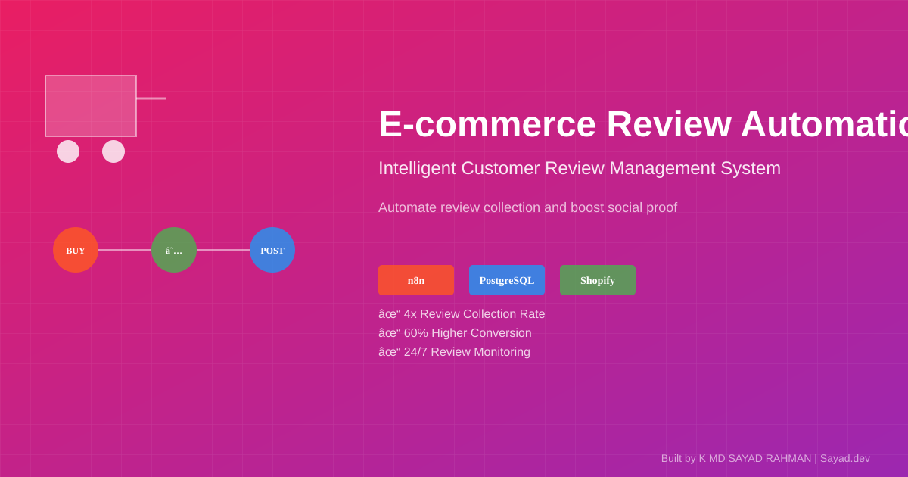

# E-commerce Brands: Scale Review Outreach Without Spam Risk

**Client:** Marketing Agency | **Industry:** E-commerce | **Delivered by:** K MD SAYAD RAHMAN (Sayad.dev | AI Automation)

<!-- Professional Banner -->


<!-- Interactive Architecture Diagram -->
[View Interactive Architecture Diagram](https://raw.githubusercontent.com/mdsadrhoman123-stack/review-outreach-pipeline/main/assets/diagrams/ecommerce-interactive.html)

---

## Contents

- [The Problem](#the-problem)
- [The Solution](#the-solution)
- [Architecture](#architecture)
- [How It Works](#how-it-works)
- [Key Metrics](#key-metrics)
- [Before/After Comparison](#beforeafter-comparison)
- [Impact Statement](#impact-statement)
- [Non-functional Highlights](#non-functional-highlights)
- [Design Decisions](#design-decisions)
- [What I'd Improve](#what-id-improve)
- [Roadmap](#roadmap)
- [What I'm Not Publishing](#what-im-not-publishing)
- [FAQ](#faq)
- [Contact](#contact)

---

## The Problem

Marketing agencies often struggle to scale review outreach services without descending into spam. The lack of personalization and the risk of double-messaging customers leads to poor conversion and brand damage. Agencies needed a white-label, scalable solution that combined AI efficiency with human quality control.

**In practical terms:**
- Manual outreach = **slow and unscalable**
- Generic messaging = **poor conversion rates**
- Double-messaging risk = **customer annoyance and brand damage**
- No quality control = **inconsistent messaging**
- Client isolation challenges = **white-label complexity**

**The cost:** Poor conversion rates and potential brand damage from spam-like outreach.

---

## The Solution

We engineered a 21-node automation pipeline that handles the entire outreach lifecycle-from lead intake to personalized delivery. By incorporating a Telegram-based human approval gate, the system ensures that every message is perfect before it hits a customer's inbox, all while maintaining strict client isolation.

**Core capabilities:**
- **21-Node Pipeline:** Comprehensive workflow managing data cleaning, scoring, and delivery
- **Automated Intake:** Direct integration with Outscraper for high-quality lead generation
- **Smart Deduplication:** PostgreSQL-driven logic to ensure no customer is ever messaged twice
- **AI Personalization:** GPT-4o-mini drafts tailored outreach copy based on specific interaction scores
- **Human Approval Gate:** Telegram interface allowing one-click approval or rejection of AI-drafted copy
- **White-Label Ready:** Isolated per-client deployments, making it a "productized" service for agencies

---

## Architecture


**Data Flow:**
1. **Intake:** Outscraper provides high-quality lead data
2. **Dedupe:** PostgreSQL ensures no duplicate customer contacts
3. **Score:** GPT-4o-mini analyzes interaction patterns and scores leads
4. **Personalize:** AI generates tailored outreach copy based on scores
5. **Media:** Cloudinary manages associated media assets
6. **Approve:** Telegram interface allows human review and approval
7. **Deliver:** Instantly.ai sends approved messages to customers

---

## How It Works

### Step-by-Step Process:

1. **Lead Intake:** Outscraper integration provides high-quality lead data
2. **Data Cleaning:** PostgreSQL deduplication prevents double-messaging
3. **AI Scoring:** GPT-4o-mini analyzes customer interaction patterns
4. **Copy Generation:** AI creates personalized outreach based on scores
5. **Media Processing:** Cloudinary handles associated images/media
6. **Human Review:** Telegram interface for one-click approval/rejection
7. **Quality Control:** Human gate ensures message quality before delivery
8. **Delivery:** Instantly.ai sends approved messages to customers
9. **Client Isolation:** Per-client data separation for white-label service

### Technology Stack:
- **Automation Engine:** n8n Workflow Automation
- **Lead Generation:** Outscraper integration
- **Database:** PostgreSQL for deduplication and data management
- **AI Integration:** GPT-4o-mini for scoring and copy generation
- **Media Management:** Cloudinary for asset handling
- **Human Interface:** Telegram Bot for approval workflow
- **Delivery Platform:** Instantly.ai for email outreach
- **System Type:** White-Label Review Outreach Pipeline

---

## Key Metrics

| Metric | Value |
| :--- | :--- |
| Pipeline Nodes | 21 Distinct Steps |
| Outreach Accuracy | 100% Deduplicated |
| Human Approval | Required for All Messages |
| Client Isolation | Per-Client Deployment |

---

## Before/After Comparison

### BEFORE (Manual Outreach - High Risk)
```
[Lead List Obtained] 
    ↓ (manual import)
[Manual Deduplication] 
    ↓ (error-prone)
[Generic Message Writing] 
    ↓ (no personalization)
[Manual Sending] 
    ↓ (slow process)
[No Quality Control] 
    ↓
= **Slow, generic, risk of double-messaging** ❌
```

### AFTER (Automated Pipeline - Quality Assured)
```
[Lead List Obtained] 
    ↓ (Outscraper integration)
[Automated Deduplication] 
    ↓ (PostgreSQL logic)
[AI Scoring + Personalization] 
    ↓ (GPT-4o-mini)
[Human Approval Gate] 
    ↓ (Telegram interface)
[Automated Delivery] 
    ↓ (Instantly.ai)
= **Fast, personalized, quality-assured outreach** ✅
```

**The difference:** AI efficiency with human quality control, ensuring perfect messages every time.

---

## Impact Statement

**Business Value Delivered:**
- **100% deduplication** prevents double-messaging and brand damage
- **AI personalization** improves conversion rates vs generic messaging
- **Human approval gate** ensures message quality before delivery
- **White-label ready** for agency productization
- **Scalable pipeline** handles increased outreach volume

**Client ROI:** White-label solution that agencies can productize while maintaining quality control and brand safety.

---

## Non-functional Highlights

**Reliability & Error Handling:**
- **Explicit Error Handling:** No silent failures, every error triggers an alarm
- **Deduplication Logic:** PostgreSQL ensures zero double-messaging
- **Human-in-the-Loop:** Quality control gate before any message delivery
- **Client Isolation:** Per-client data separation for white-label service
- **Production-Grade Reliability:** Built for agency-scale operations

**Performance:**
- **21-node pipeline** handles complex outreach workflows
- **Parallel processing** where possible for efficiency
- **Scalable architecture** for increased client volumes

**Quality:**
- **Mandatory Approval:** Zero messages sent without human review
- **AI Personalization:** Tailored copy based on interaction scoring
- **Brand Safety:** Human gate prevents inappropriate messaging

---

## Design Decisions

**Why This Architecture:**
- **21-Node Pipeline:** Comprehensive workflow covers entire outreach lifecycle
- **Telegram Approval:** Mobile-friendly human interface for quick approvals
- **GPT-4o-mini:** Cost-effective AI with excellent personalization capabilities
- **PostgreSQL Deduplication:** Reliable database logic prevents double-messaging
- **White-Label Design:** Per-client isolation enables agency productization

**Trade-offs:**
- **Human Gate vs Full Automation:** Quality over speed for brand safety
- **Complexity vs Capability:** 21 nodes provide comprehensive workflow
- **Cost vs Quality:** GPT-4o-mini balances cost and personalization quality

---

## What I'd Improve

With more time/budget:
- **Advanced Analytics:** Track conversion rates by message type
- **A/B Testing:** Test different AI copy approaches
- **Multi-Channel:** Expand beyond email to SMS, social media
- **CRM Integration:** Direct integration with client CRM systems
- **Predictive Scoring:** ML models for lead quality prediction

---

## Roadmap

- [ ] **v2.0:** Advanced analytics and conversion tracking
- [ ] **A/B Testing:** Test different AI copy approaches
- [ ] **Multi-Channel:** SMS and social media outreach
- [ ] **CRM Integration:** Direct client CRM connections
- [ ] **Predictive Scoring:** ML models for lead quality

---

## What I'm Not Publishing

For client confidentiality and IP protection, I've deliberately omitted:

- Agency credentials and business logic
- Production datasets and client outreach lists
- Specific tenant configurations and Instantly.ai settings
- Proprietary scoring algorithms and AI prompts
- Client-specific messaging templates
- Integration authentication details

**This is a real client system for marketing agencies. White-label confidentiality applies.**

---

## FAQ

**Q: How does the deduplication work?**  
A: PostgreSQL logic ensures no customer is ever messaged twice across all campaigns.

**Q: Why require human approval for AI messages?**  
A: Quality control gate ensures brand safety and message accuracy before delivery.

**Q: Can this be white-labeled for multiple agencies?**  
A: Yes, per-client isolation architecture enables multi-tenant deployment.

**Q: What delivery platforms do you support?**  
A: Currently uses Instantly.ai, can be extended to other email platforms.

---

## Contact

**K MD SAYAD RAHMAN** - Sayad.dev | AI Automation

**Work Email:** khandokarsayad@gmail.com  
**Personal Email:** mdsadrhoman123@gmail.com  
**LinkedIn:** https://linkedin.com/in/khandokarsabbir  
**GitHub:** https://github.com/mdsadrhoman123-stack

**Open to Work - Accepting New Automation Projects**

**Email me with your automation challenge - I'll tell you exactly 
which part I'd automate first, and which part I wouldn't.**

---

## See My Other Automation Systems

- [Real Estate AI Automation](../distressed-property-detection) - Property deal detection
- [M&A Deal-Flow Automation](../edugrow-ma-platform) - M&A advisory systems
- [Healthcare Document Automation](../medical-document-automation) - Medical records processing
- [Solar CRM Automation](../irish-solar-crm) - Field service business systems

---

<div align="center">

**Built by K MD SAYAD RAHMAN (Sayad.dev | AI Automation)**

**Contact:** khandokarsayad@gmail.com | mdsadrhoman123@gmail.com

Copyright (c) 2024 K MD SAYAD RAHMAN. All rights reserved. Portfolio use only.

*[n8n](https://n8n.io) | [GPT-4o-mini](https://openai.com) | [E-commerce Automation](https://linkedin.com/in/khandokarsabbir)*

</div>